<div align="center">



### 🚀 Coding like it's 2050, but debugging like it's 1999.

[](https://s3hq4y.github.io)
[](https://discord.gg/HnmEeeNrKF)
[](mailto:s9y@outlook.sg)

</div>

---

```ts
const s9y = {
  location:  "🌍 Earth",
  building:  ["grand-strategy game engines", "3D globes", "AI tooling"],
  stack:     ["TypeScript", "React / Vue", "Node / Go", "Three.js / Babylon.js / PlayCanvas"],
  currently: "building WHAT I LOVE",
  motto:     "ship it, then make it elegant",
} as const;
```

- 🌍 Based on **Earth**
- 🤖 Currently building **WHAT I LOVE**
- 🧠 Exploring **AI** to create smarter user experiences
- ⚡ Always diving into **new tech** to stay ahead

---

##  Technical Skills

<details open>
<summary><b>Languages</b></summary>


</details>

<details open>
<summary><b>Frontend</b></summary>


</details>

<details open>
<summary><b>Graphics &amp; Game Tech</b></summary>


</details>

<details>
<summary><b>Backend, Data &amp; Infra</b></summary>


</details>

---

## 📊 GitHub Stats

<table align="center" border="0">
  <tr>
    <td align="center" valign="top">
      
    </td>
    <td align="center" valign="top">
      
    </td>
  </tr>
  <tr>
    <td colspan="2" align="center">
      
    </td>
  </tr>
</table>

<div align="center">
<sub>Cards are generated in-repo by <code>scripts/gen_stats.py</code> and refreshed daily by GitHub Actions — no third-party rate limits.</sub>
</div>

---

## 🐍 Contribution Graph

<div align="center">
  <picture>
    <source media="(prefers-color-scheme: dark)" srcset="https://raw.githubusercontent.com/platane/platane/output/github-contribution-grid-snake-dark.svg">
    <source media="(prefers-color-scheme: light)" srcset="https://raw.githubusercontent.com/platane/platane/output/github-contribution-grid-snake.svg">
    
  </picture>
</div>

---

<div align="center">


<sub>⭐ Thanks for stopping by — let's build something impossible.</sub>

</div>
